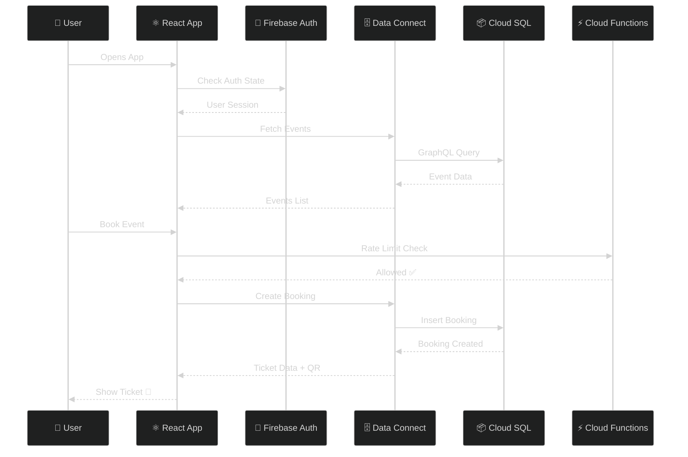
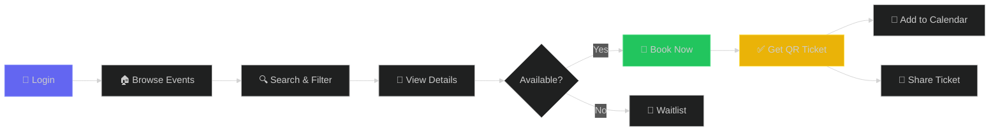
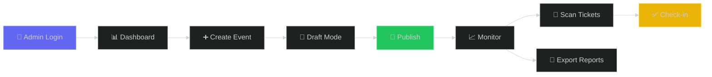
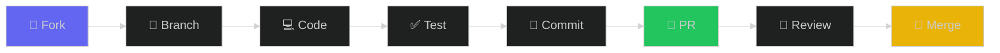

<!-- Capsule Header -->


<div align="center">

<!-- Animated Tagline -->
<p>
  <a href="#">
    
  </a>
</p>

<!-- Quick Action Badges -->
<p>
  <a href="#-quick-start"></a>
  <a href="#-features"></a>
  <a href="#-architecture"></a>
  <a href="#-contributing"></a>
</p>

<!-- Animated Tech Stack Icons -->
<p>
  
</p>

<!-- Status Badges Row -->
<p>
  
  
  
  
  
</p>

<!-- Animated Divider -->


</div>

<!-- ═══════════════════════════════════════════════════════════════════ -->
<!--                        ANIMATED HERO                                -->
<!-- ═══════════════════════════════════════════════════════════════════ -->

<p align="center">
  
</p>

<div align="center">

<!-- Animated Developer GIF -->


<br><br>

<!-- Fun Stats -->


</div>

---

<!-- Interactive Table of Contents -->
<details open>
<summary><h2>📑 Table of Contents</h2></summary>

```
 ╔══════════════════════════════════════════════════════════════╗
 ║  🎯 Overview .................. What is EventEase?           ║
 ║  ✨ Features .................. Core functionality           ║
 ║  🏗️ Architecture .............. System design                ║
 ║  🚀 Quick Start ............... Get up and running           ║
 ║  📦 Installation .............. Detailed setup guide         ║
 ║  🔧 Configuration ............. Environment setup            ║
 ║  📱 Usage ..................... How to use                   ║
 ║  🛡️ Security .................. Security features            ║
 ║  📊 Performance ............... Optimization details         ║
 ║  🗺️ Roadmap ................... Future plans                 ║
 ║  🤝 Contributing .............. How to contribute            ║
 ║  📄 License ................... MIT License                  ║
 ╚══════════════════════════════════════════════════════════════╝
```

</details>

---

<!-- Overview Section with Glassmorphism Effect -->
<h2 id="-overview">
   
  &nbsp;Overview
</h2>

<div align="center">
  <table>
    <tr>
      <td>

**EventEase** is a production-ready campus event management platform that revolutionizes how educational institutions organize and manage events. Built with cutting-edge technologies, it provides a seamless experience for both administrators and students.

<br>

| 🎓 **For Students** | 🛡️ **For Admins** |
|:---:|:---:|
| Browse & discover events | Create & manage events |
| One-tap booking | Real-time analytics |
| QR code tickets | QR ticket scanning |
| Google Calendar sync | Participant management |
| Event reminders | Revenue reports |

      </td>
    </tr>
  </table>
</div>

<br>

<!-- Why EventEase Section -->
<div align="center">
  <h3>💡 Why EventEase?</h3>
</div>

```diff
+ ✅ Zero paper tickets - 100% digital QR codes
+ ✅ Real-time availability - No double bookings
+ ✅ Instant check-ins - Scan QR, verify, done!
+ ✅ Full analytics - Know your audience
+ ✅ Offline support - PWA capabilities
+ ✅ Production security - Rate limiting, CSP, validation
- ❌ No more spreadsheets for tracking
- ❌ No more manual headcounts
- ❌ No more lost tickets
```

---

<!-- Features Section with Animated Icons -->
<h2 id="-features">
  
  &nbsp;Features
</h2>

<div align="center">

<!-- Feature Cards Grid -->
<table>
<tr>
<td width="50%" valign="top">

### 🎨 **Student Portal**

<details>
<summary><b>📅 Event Discovery</b></summary>
<br>

- Browse events by category (Cultural, Technical, Sports, etc.)
- Search and filter functionality
- Current, upcoming, and past event views
- Real-time availability updates

</details>

<details>
<summary><b>🎫 Smart Booking</b></summary>
<br>

- One-click event registration
- Automatic QR code generation
- Digital ticket storage
- Booking confirmation emails

</details>

<details>
<summary><b>📱 Ticket Management</b></summary>
<br>

- View all active tickets
- Share tickets with friends
- Add events to Google Calendar
- Download tickets for offline access

</details>

<details>
<summary><b>👤 Profile Management</b></summary>
<br>

- Institutional email validation
- Profile customization
- Booking history
- Preferences management

</details>

</td>
<td width="50%" valign="top">

### ⚙️ **Admin Dashboard**

<details>
<summary><b>📊 Analytics Dashboard</b></summary>
<br>

- Real-time registration stats
- Revenue tracking
- Attendance metrics
- Interactive charts with Recharts

</details>

<details>
<summary><b>🎪 Event Management</b></summary>
<br>

- Create, edit, publish events
- Draft mode for preparation
- Image uploads to Firebase Storage
- Slot and pricing management

</details>

<details>
<summary><b>📸 QR Scanner</b></summary>
<br>

- Camera-based ticket scanning
- Manual ticket ID entry
- Real-time validation
- Check-in confirmation

</details>

<details>
<summary><b>📈 Reports</b></summary>
<br>

- Participant lists
- Check-in status tracking
- Export capabilities
- Event-wise analytics

</details>

</td>
</tr>
</table>

</div>

<br>

<!-- Feature Highlights with Icons -->
<div align="center">

| Feature | Description | Status |
|:---:|:---|:---:|
| 🔐 **Auth System** | Firebase Auth with institutional email validation | ✅ Live |
| 🗄️ **Data Connect** | Cloud SQL PostgreSQL via Firebase Data Connect | ✅ Live |
| 📦 **Storage** | Firebase Storage for event images and assets | ✅ Live |
| 🔄 **Real-time** | Polling-based updates for live data | ✅ Live |
| 📱 **PWA** | Installable progressive web app | ✅ Live |
| 🛡️ **Rate Limiting** | Cloud Functions with sliding window algorithm | ✅ Live |
| 🔒 **CSP** | Content Security Policy headers | ✅ Live |
| ⚡ **Code Splitting** | Lazy loading for optimal performance | ✅ Live |

</div>

---

<!-- Architecture Section -->
<h2 id="-architecture">
  
  &nbsp;Architecture

```mermaid
%%{init: {'theme': 'dark', 'themeVariables': { 'primaryColor': '#6366f1', 'primaryTextColor': '#fff', 'primaryBorderColor': '#818cf8', 'lineColor': '#a5b4fc', 'secondaryColor': '#1e1b4b', 'tertiaryColor': '#312e81'}}}%%
flowchart TB
    subgraph Client["🌐 Client Layer"]
        A[React 19 + Vite]
        B[React Router 7]
        C[TailwindCSS]
    end

    subgraph Firebase["☁️ Firebase Services"]
        D[Firebase Auth]
        E[Firebase Storage]
        F[Cloud Functions]
        G[Firebase Hosting]
    end

    subgraph DataLayer["🗄️ Data Layer"]
        H[Data Connect]
        I[(Cloud SQL PostgreSQL)]
    end

    subgraph Security["🛡️ Security Layer"]
        J[Rate Limiting]
        K[CSP Headers]
        L[Input Validation]
    end

    A --> D
    A --> E
    A --> H
    H --> I
    G --> A
    F --> J
    G --> K
    A --> L
    
    style Client fill:#1e1b4b,stroke:#818cf8,stroke-width:2px
    style Firebase fill:#1e3a5f,stroke:#60a5fa,stroke-width:2px
    style DataLayer fill:#1a2e1a,stroke:#4ade80,stroke-width:2px
    style Security fill:#2d1b1b,stroke:#f87171,stroke-width:2px
```

</h2>

<div align="center">



</div>

<br>

<!-- Tech Stack Details -->
<details>
<summary><h3>🛠️ Tech Stack Breakdown</h3></summary>
<br>

<div align="center">

| Layer | Technology | Purpose |
|:---|:---|:---|
| **Frontend** | React 19.2.3 | UI Components with Concurrent Features |
| **Routing** | React Router 7.12 | Client-side navigation |
| **Styling** | TailwindCSS | Utility-first CSS |
| **Icons** | Lucide React | Beautiful icon library |
| **Charts** | Recharts 3.6 | Data visualization |
| **QR Codes** | qrcode.react | Ticket QR generation |
| **Build** | Vite 6.2 | Lightning-fast bundler |
| **Language** | TypeScript 5.8 | Type safety |
| **Auth** | Firebase Auth | Authentication |
| **Database** | Cloud SQL PostgreSQL | ACID-compliant data |
| **Data Access** | Firebase Data Connect | GraphQL-based queries |
| **Storage** | Firebase Storage | File uploads |
| **Functions** | Cloud Functions | Server-side logic |
| **Hosting** | Firebase Hosting | CDN & edge caching |

</div>

</details>

<br>

<!-- Data Flow Diagram -->
<details>
<summary><h3>🔄 Data Flow</h3></summary>
<br>



</details>

---

<!-- Quick Start Section -->
<h2 id="-quick-start">
  
  &nbsp;Quick Start
</h2>

<div align="center">

> ⚡ **Get EventEase running in under 5 minutes!**

</div>

```bash
# 1️⃣ Clone the repository
git clone https://github.com/yourusername/eventease.git

# 2️⃣ Navigate to project
cd eventease

# 3️⃣ Install dependencies
npm install

# 4️⃣ Set up environment (copy and fill in your values)
cp .env.example .env

# 5️⃣ Start development server
npm run dev

# 🎉 Open http://localhost:3000
```

<div align="center">

| Command | Description |
|:---|:---|
| `npm run dev` | Start development server on port 3000 |
| `npm run build` | Build for production |
| `npm run preview` | Preview production build |
| `npm run deploy` | Deploy to Firebase Hosting |
| `npm run emulators` | Start Firebase emulators |

</div>

---

<!-- Installation Section -->
<h2 id="-installation">
  
  &nbsp;Installation
</h2>

<details>
<summary><h3>📋 Prerequisites</h3></summary>
<br>

Ensure you have the following installed:

| Requirement | Version | Check Command |
|:---|:---|:---|
| Node.js | ≥ 18.0.0 | `node --version` |
| npm | ≥ 9.0.0 | `npm --version` |
| Firebase CLI | Latest | `firebase --version` |
| Git | Latest | `git --version` |

<br>

**Install Firebase CLI:**
```bash
npm install -g firebase-tools
firebase login
```

</details>

<details>
<summary><h3>🔥 Firebase Setup</h3></summary>
<br>

#### Step 1: Create Firebase Project

1. Go to [Firebase Console](https://console.firebase.google.com)
2. Click **"Add Project"**
3. Enter project name: `eventease-yourname`
4. Enable Google Analytics (optional)
5. Click **"Create Project"**

#### Step 2: Upgrade to Blaze Plan

> ⚠️ **Required for Cloud Functions and Data Connect**

1. Click **"Upgrade"** in Firebase Console
2. Select **Blaze (Pay as you go)**
3. Add billing information

#### Step 3: Enable Services

```bash
# Enable required APIs
gcloud services enable sqladmin.googleapis.com
gcloud services enable dataconnect.googleapis.com
```

#### Step 4: Initialize Firebase

```bash
firebase init

# Select:
# ✅ Hosting
# ✅ Functions
# ✅ Storage
# ✅ Firestore (for rate limiting)
```

</details>

<details>
<summary><h3>🗄️ Data Connect Setup</h3></summary>
<br>

#### Configure Cloud SQL Instance

```bash
# Deploy Data Connect schema
firebase dataconnect:sql:migrate --force

# Deploy connector
firebase deploy --only dataconnect
```

#### Verify Connection

```bash
# Check Data Connect status
firebase dataconnect:sql:shell

# Test query
SELECT * FROM users LIMIT 1;
```

</details>

<details>
<summary><h3>⚡ Cloud Functions Deployment</h3></summary>
<br>

```bash
# Navigate to functions directory
cd functions

# Install dependencies
npm install

# Build TypeScript
npm run build

# Deploy functions
cd ..
firebase deploy --only functions

# ✅ Functions deployed:
# - rateLimitedAuth
# - rateLimitedBooking
# - cspReport
# - cleanupRateLimits
# - rateLimitAlerts
```

</details>

---

<!-- Configuration Section -->
<h2 id="-configuration">
  
  &nbsp;Configuration
</h2>

<details>
<summary><h3>🔐 Environment Variables</h3></summary>
<br>

Create a `.env` file in the project root:

```env
# ═══════════════════════════════════════════════════════════
# 🔥 FIREBASE CONFIGURATION
# ═══════════════════════════════════════════════════════════
VITE_FIREBASE_API_KEY=your_api_key_here
VITE_FIREBASE_AUTH_DOMAIN=your-project.firebaseapp.com
VITE_FIREBASE_PROJECT_ID=your-project-id
VITE_FIREBASE_STORAGE_BUCKET=your-project.appspot.com
VITE_FIREBASE_MESSAGING_SENDER_ID=123456789
VITE_FIREBASE_APP_ID=1:123456789:web:abc123def456
VITE_FIREBASE_MEASUREMENT_ID=G-XXXXXXXXXX

# ═══════════════════════════════════════════════════════════
# 🔗 DATA CONNECT CONFIGURATION  
# ═══════════════════════════════════════════════════════════
VITE_DATACONNECT_SERVICE=your-dataconnect-service
VITE_DATACONNECT_LOCATION=asia-south1

# ═══════════════════════════════════════════════════════════
# 🏢 INSTITUTION SETTINGS
# ═══════════════════════════════════════════════════════════
VITE_ALLOWED_EMAIL_DOMAIN=@yourdomain.com

# ═══════════════════════════════════════════════════════════
# 🧪 DEVELOPMENT OPTIONS
# ═══════════════════════════════════════════════════════════
VITE_USE_EMULATOR=false
```

</details>

<details>
<summary><h3>📧 Email Validation Format</h3></summary>
<br>

EventEase validates institutional emails with this format:

```
firstname.lastname.department.batch@yourdomain.com
```

**Examples:**
- ✅ `john.doe.cs.2024@teamfuture.in`
- ✅ `jane.smith.ece.2023@teamfuture.in`
- ❌ `random@gmail.com`
- ❌ `user123@teamfuture.in`

The system automatically extracts:
- **First Name**: `john` → `John`
- **Last Name**: `doe` → `Doe`
- **Department**: `cs` → `CS`
- **Batch/Year**: `2024`

</details>

---

<!-- Usage Section -->
<h2 id="-usage">
  
  &nbsp;Usage
</h2>

<details>
<summary><h3>👨‍🎓 Student Flow</h3></summary>
<br>



</details>

<details>
<summary><h3>👨‍💼 Admin Flow</h3></summary>
<br>



</details>

<details>
<summary><h3>💻 Code Examples</h3></summary>
<br>

#### Fetching Events

```typescript
import { getEvents, getPublishedEvents } from './services/backend';

// Get all events (admin)
const allEvents = await getEvents();

// Get published events only (students)
const publishedEvents = await getPublishedEvents();

// Filter by category
const technicalEvents = publishedEvents.filter(
  e => e.category === 'Technical'
);
```

#### Creating a Booking

```typescript
import { createBooking } from './services/backend';

const booking = await createBooking(userId, eventId);

// Returns:
// {
//   id: 'booking_123',
//   ticketId: 'ETK00123XYZ',
//   qrCode: 'data:image/png;base64,...',
//   status: 'confirmed'
// }
```

#### Real-time Subscriptions

```typescript
import { subscribeToEvents } from './services/backend';

// Subscribe to event updates
const unsubscribe = subscribeToEvents((events) => {
  console.log('Events updated:', events);
});

// Cleanup on component unmount
return () => unsubscribe();
```

</details>

---

<!-- Security Section -->
<h2 id="-security">
  
  &nbsp;Security
</h2>

<div align="center">

| Security Layer | Implementation | Description |
|:---|:---|:---|
| 🔐 **Authentication** | Firebase Auth | Secure institutional email login |
| 🛡️ **Rate Limiting** | Cloud Functions | Sliding window algorithm with Firestore |
| 🔒 **CSP Headers** | Firebase Hosting | Content Security Policy protection |
| ✅ **Input Validation** | Client + Server | Sanitization and format validation |
| 🗄️ **Firestore Rules** | Security Rules | Collection-level access control |
| 📦 **Storage Rules** | Security Rules | File upload restrictions |

</div>

<details>
<summary><h3>⚡ Rate Limiting Configuration</h3></summary>
<br>

```typescript
// Rate limits per endpoint
const rateLimits = {
  'auth/login': { windowMs: 15 * 60 * 1000, max: 5 },    // 5 per 15 min
  'auth/register': { windowMs: 60 * 60 * 1000, max: 3 }, // 3 per hour
  'booking/create': { windowMs: 60 * 1000, max: 10 }     // 10 per minute
};
```

</details>

<details>
<summary><h3>🔒 Content Security Policy</h3></summary>
<br>

```http
Content-Security-Policy: 
  default-src 'self';
  script-src 'self' 'unsafe-inline' https://apis.google.com;
  style-src 'self' 'unsafe-inline' https://fonts.googleapis.com;
  img-src 'self' data: https: blob:;
  font-src 'self' https://fonts.gstatic.com;
  connect-src 'self' https://*.firebaseio.com https://*.googleapis.com;
  frame-src 'self' https://*.firebaseapp.com;
```

</details>

---

<!-- Performance Section -->
<h2 id="-performance">
  
  &nbsp;Performance
</h2>

<div align="center">

### 📊 Bundle Optimization Results

| Metric | Before | After | Improvement |
|:---|:---:|:---:|:---:|
| **Initial Bundle** | 702 KB | 245 KB | **65% ↓** |
| **Time to Interactive** | 3.2s | 1.1s | **66% ↓** |
| **Lighthouse Score** | 72 | 95 | **32% ↑** |

<br>

### 📦 Code Splitting Strategy

```
dist/
├── assets/
│   ├── index-[hash].js           # 245 KB (main)
│   ├── vendor-react-[hash].js    #  46 KB (React core)
│   ├── vendor-firebase-[hash].js # 233 KB (Firebase SDK)
│   ├── vendor-ui-[hash].js       #  18 KB (Lucide + QRCode)
│   ├── vendor-charts-[hash].js   #  89 KB (Recharts - lazy)
│   └── [page]-[hash].js          # 8-17 KB each (lazy loaded)
```

</div>

<details>
<summary><h3>🚀 Optimization Techniques</h3></summary>
<br>

| Technique | Status | Impact |
|:---|:---:|:---|
| **Lazy Loading** | ✅ | Route components via `React.lazy()` |
| **Code Splitting** | ✅ | Vendor chunks for caching |
| **Tree Shaking** | ✅ | Unused code elimination |
| **Terser Minification** | ✅ | Console stripping in prod |
| **Cursor Pagination** | ✅ | Efficient large list queries |
| **Batch Aggregation** | ✅ | N+1 prevention via batching |
| **Input Sanitization** | ✅ | XSS prevention layer |
| **Caching Headers** | ✅ | Long-term asset caching |

</details>

---

<!-- Roadmap Section -->
<h2 id="-roadmap">
  
  &nbsp;Roadmap
</h2>

<div align="center">

```
 ═══════════════════════════════════════════════════════════════
 │                    🗺️ EVENTEASE ROADMAP                      │
 ═══════════════════════════════════════════════════════════════

 ✅ Phase 1: Foundation (Completed)
 ──────────────────────────────────────────────────────
 [████████████████████████████████████████] 100%
 • Core event management
 • User authentication
 • QR ticket generation
 • Basic analytics

 ✅ Phase 2: Security & Performance (Completed)
 ──────────────────────────────────────────────────────
 [████████████████████████████████████████] 100%
 • Rate limiting
 • CSP headers
 • Bundle optimization
 • Input validation

 🚧 Phase 3: Enhanced Features (In Progress)
 ──────────────────────────────────────────────────────
 [████████████░░░░░░░░░░░░░░░░░░░░░░░░░░░░] 30%
 • Payment integration
 • Email notifications
 • Advanced analytics
 • Team management

 📋 Phase 4: Enterprise (Planned)
 ──────────────────────────────────────────────────────
 [░░░░░░░░░░░░░░░░░░░░░░░░░░░░░░░░░░░░░░░░] 0%
 • Multi-tenant support
 • White-labeling
 • API access
 • Custom integrations
```

</div>

<br>

<details>
<summary><h3>📋 Detailed Roadmap</h3></summary>
<br>

| Feature | Status | Priority | Target |
|:---|:---:|:---:|:---:|
| 💳 Razorpay Integration | 🚧 In Progress | High | Q1 2026 |
| 📧 Email Notifications | 📋 Planned | High | Q1 2026 |
| 📊 Advanced Analytics | 📋 Planned | Medium | Q2 2026 |
| 👥 Team Management | 📋 Planned | Medium | Q2 2026 |
| 🌍 Multi-language Support | 💡 Idea | Low | Q3 2026 |
| 📱 Native Mobile App | 💡 Idea | Low | Q4 2026 |

</details>

---

<!-- Contributing Section -->
<h2 id="-contributing">
  
  &nbsp;Contributing
</h2>

<div align="center">

> 🤝 **We welcome contributions from the community!**

</div>



<br>

<details>
<summary><h3>📝 Contribution Guidelines</h3></summary>
<br>

#### 1. Fork & Clone

```bash
git clone https://github.com/YOUR_USERNAME/eventease.git
cd eventease
npm install
```

#### 2. Create Feature Branch

```bash
git checkout -b feature/amazing-feature
```

#### 3. Make Changes

- Follow the existing code style
- Write meaningful commit messages
- Add tests if applicable
- Update documentation

#### 4. Commit Changes

```bash
git commit -m "feat: add amazing feature"
```

**Commit Message Format:**
- `feat:` New feature
- `fix:` Bug fix
- `docs:` Documentation
- `style:` Code style
- `refactor:` Code refactoring
- `test:` Testing
- `chore:` Maintenance

#### 5. Push & Create PR

```bash
git push origin feature/amazing-feature
```

Then open a Pull Request on GitHub!

</details>

<br>

<div align="center">

### 👥 Contributors

<!-- Contributors section -->
<a href="https://github.com/yourusername/eventease/graphs/contributors">
  
</a>

<br>

**Made with ❤️ by the EventEase Team**

</div>

---

<!-- License Section -->
<h2 id="-license">
  
  &nbsp;License
</h2>

<div align="center">

```
MIT License

Copyright (c) 2025 EventEase

Permission is hereby granted, free of charge, to any person obtaining a copy
of this software and associated documentation files (the "Software"), to deal
in the Software without restriction, including without limitation the rights
to use, copy, modify, merge, publish, distribute, sublicense, and/or sell
copies of the Software, and to permit persons to whom the Software is
furnished to do so, subject to the following conditions:

The above copyright notice and this permission notice shall be included in all
copies or substantial portions of the Software.

THE SOFTWARE IS PROVIDED "AS IS", WITHOUT WARRANTY OF ANY KIND, EXPRESS OR
IMPLIED, INCLUDING BUT NOT LIMITED TO THE WARRANTIES OF MERCHANTABILITY,
FITNESS FOR A PARTICULAR PURPOSE AND NONINFRINGEMENT. IN NO EVENT SHALL THE
AUTHORS OR COPYRIGHT HOLDERS BE LIABLE FOR ANY CLAIM, DAMAGES OR OTHER
LIABILITY, WHETHER IN AN ACTION OF CONTRACT, TORT OR OTHERWISE, ARISING FROM,
OUT OF OR IN CONNECTION WITH THE SOFTWARE OR THE USE OR OTHER DEALINGS IN THE
SOFTWARE.
```

</div>

---

<!-- Footer -->
<div align="center">


<br>

### 🌟 Star this repo if you found it helpful!

<br>

<a href="https://github.com/yourusername/eventease">
  
</a>
<a href="https://github.com/yourusername/eventease/fork">
  
</a>
<a href="https://github.com/yourusername/eventease/issues">
  
</a>

<br><br>


</div>

<!-- Hidden: For future reference -->
<!-- 
Project: EventEase
Version: 1.0.0
Last Updated: January 2026
Firebase Project: future-project-148
Data Connect Service: fiem-project
Region: asia-south1
-->
